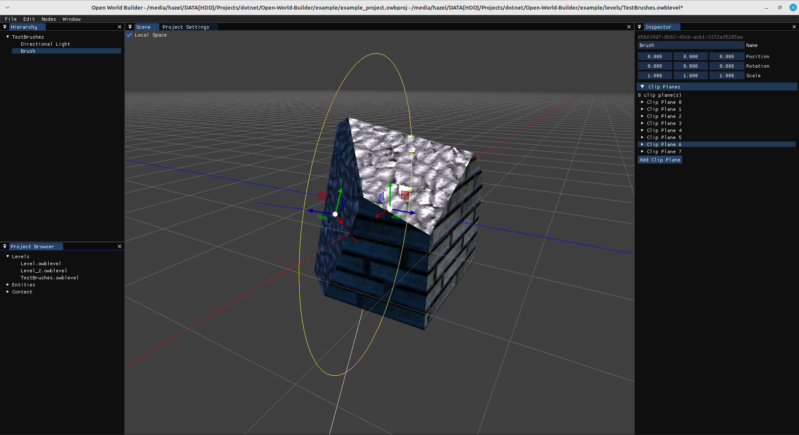
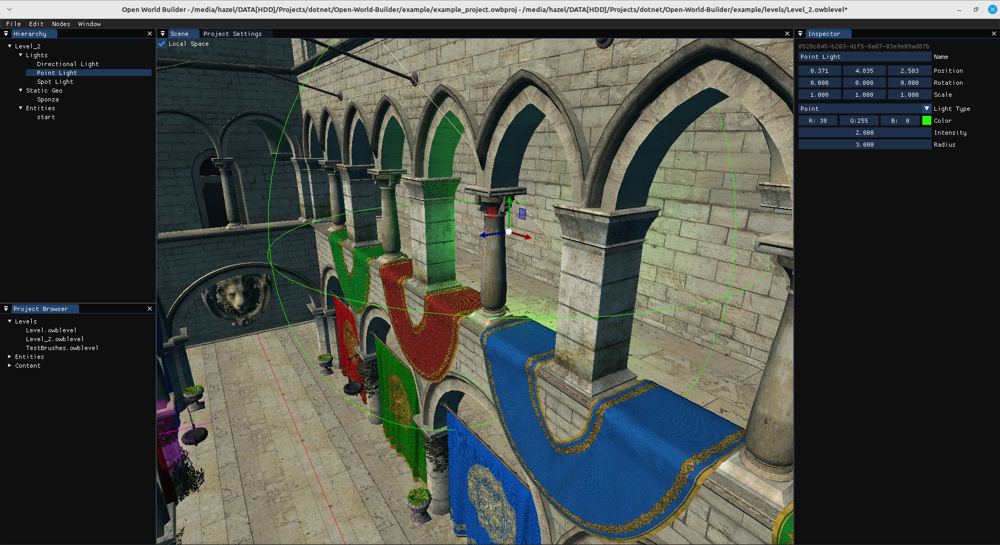
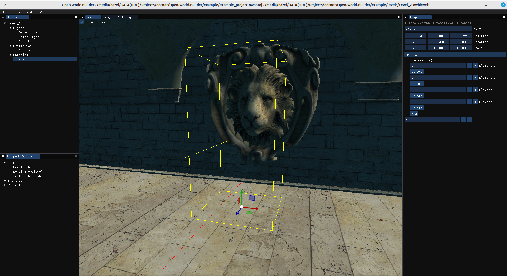
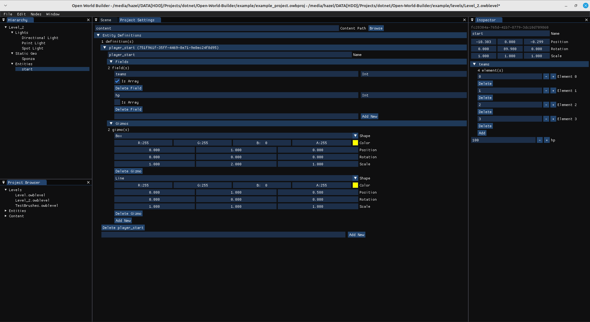

# Open World Builder
Open source level editor toolkit built on FNA+ImGui.NET

## Goal
An open-source generic 3D level editor designed to be integrated into any game or engine.
Inspired by the way LDTK, Ogmo, and Tiled serve as generic 2D tile based editors, and also taking inspiration from Unity Editor, Godot, and Trenchbroom.

## Screenshots

## Dependencies
Open World Builder requires the .NET 7.0 SDK to compile.

It depends on [FNA](https://github.com/FNA-XNA/FNA), [SDL2-CS](https://github.com/flibitijibibo/SDL2-CS), [ImGui.NET](https://github.com/GlaireDaggers/ImGui.NET), and [NativeFileDialogSharp](https://github.com/milleniumbug/NativeFileDialogSharp).

## Compiling Open World Builder
Clone Open-World-Builder then:

1. Run `git submodule update --init --recursive` to fetch all submodule dependencies
2. Open the `src` subfolder in a terminal
3. Run `dotnet build --configuration Release /p:Platform=x64`
4. Find the built executable in `src/bin/x64/Release/net7.0/[linux-x64|win-x64]`

## Quick Start
1. After opening OWB, save a new project by going to File &rarr; Save Project
2. Open the project settings (Window &rarr; Project Settings) and set your new project's content path (recommended to put a "content" folder next to the project file you saved and set this as your project's content path). This is where all visual assets will reside for level editing (meshes, textures, etc)
3. To save a new level, open the Hierarchy (Window &rarr; Hierarchy) and the Inspector (Window &rarr; Inspector), change the name of the level by selecting the root node in the Hierarchy and changing it's name in the Inspector, and then press CTRL-S or File &rarr; Save Level. The saved level will appear in the Project Browser (Window &rarr; Project Browser) under the "Levels" dropdown, on-disk as `levels/[level_name].owblevel` next to the project file.

## Using OWB files in your game/engine
OWB outputs two types of files: `.owbproject` and `.owblevel`. These are both simply JSON files.
A schema describing this format can be found in the `schema` folder in this repository, and example .CS files for use with Newtonsoft.JSON matching this schema can be found in this folder as well.

Note that several types are represented as formatted strings rather than JSON objects (mostly vectors, quaternions, & colors). Wherever applicable, these are annotated with a comment in the `.schema.json` files.
